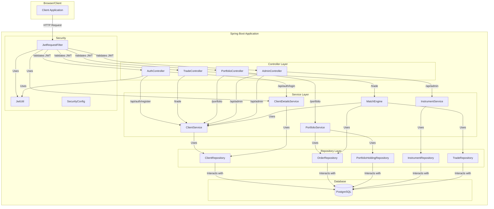

# Stock Market Match Engine

This project is a full-stack stock trading application featuring a Spring Boot back-end and a React front-end. It includes user authentication, portfolio management, and a real-time order matching engine.

## Features

- **User Authentication:** Secure user registration and login using JWT.
- **Portfolio Management:** View and manage your stock and cash balances.
- **Order Matching Engine:** Real-time matching of buy and sell orders.
- **Trade Execution:** Buy and sell stocks using USDT as the currency.
- **Transaction History:** View a complete history of your past trades.
- **Containerized:** The entire application can be run with a single Docker Compose command.

## About This Project

This project was designed to be a comprehensive, real-world example of a modern web application, demonstrating skills across back-end, front-end, security, and DevOps.

### Back-End Architecture

The back-end is built with Spring Boot and features a real-time, in-memory **Order Matching Engine**. The core of the engine uses a **price-time priority** algorithm to ensure fairness in trade execution. To handle high-performance and thread-safe operations under concurrent load, I utilized advanced Java data structures, including a `ConcurrentHashMap` to manage the order books for different tickers and a `Deque` for the order queues at each price level.

Data integrity is paramount in a financial application. To guarantee this, all critical database operations (such as updating user balances and stock holdings after a trade) are wrapped in a single service method and annotated with `@Transactional`. This ensures **ACID properties**, meaning a trade and its corresponding portfolio updates succeed or fail as a single, atomic unit, preventing data corruption.

### Architecture Diagram



### Architectural Best Practices: Separation of Layers

A key architectural principle implemented in this project is the strict **separation of layers**. The application is divided into three distinct tiers:

1.  **Controller Layer:** Responsible only for handling HTTP requests and responses. It acts as the entry point, delegating all business logic to the service layer.
2.  **Service Layer:** Contains all the core business logic. It orchestrates repository calls, performs validations, and manages transactions. This centralizes the application's logic, making it more maintainable and reusable.
3.  **Repository Layer:** Responsible for all data access operations, interacting directly with the database.

This separation makes the codebase cleaner, more organized, and significantly easier to test, as each layer can be tested in isolation.

### Security

Security is implemented from the ground up using Spring Security with a stateless **JSON Web Token (JWT)** authentication flow. When a user logs in, the back-end generates a signed JWT. This token is then required in the `Authorization` header for all protected API endpoints. A custom `JwtRequestFilter` intercepts each request to validate the token, ensuring that every API call is authenticated without relying on server-side sessions. This stateless approach is crucial for scalability and building microservices-ready applications.

### Front-End Architecture

The front-end is a responsive **Single-Page Application (SPA)** built with React. It features a clean, component-based architecture (e.g., `Dashboard`, `Login`, `Transactions`) and uses React Hooks (`useState`, `useEffect`) for efficient state management and handling component lifecycle events. Communication with the back-end REST API is handled asynchronously using `axios`, with the JWT managed securely in the browser's local storage to maintain the user's session.

### DevOps and Containerization

The entire application stack is containerized using **Docker and Docker Compose**, allowing the project (front-end, back-end, and database) to be launched with a single command (`docker-compose up`). For the React front-end, I implemented a **multi-stage Docker build**. The first stage uses a Node.js image to build the static assets, and the second stage copies these assets into a lightweight `nginx` container for serving. This best practice results in a smaller, faster, and more secure production image.

### Challenges & Solutions

- **Challenge: Refactoring to a Code-First, Service-Oriented Architecture.**
  - **Problem:** The project was initially developed with an API-first approach, which led to some business logic residing directly in the controllers. This made the controllers bloated and tightly coupled to the data layer.
  - **Solution:** I undertook a significant refactoring effort to move all business logic into a dedicated **service layer**. This involved creating new service classes (`ClientService`, `PortfolioService`, `InstrumentService`) and updating the controllers to delegate all logic to these services. This resulted in leaner controllers, better separation of concerns, and a more maintainable and testable codebase.

- **Challenge: Concurrency in the Matching Engine.**
  - **Problem:** The engine needed to handle simultaneous orders without causing race conditions.
  - **Solution:** I chose `ConcurrentHashMap` and `Deque` to create a thread-safe order book structure, allowing for high-throughput, non-blocking reads and safe, concurrent writes.

- **Challenge: Stateless Authentication in a Decoupled System.**
  - **Problem:** Managing user sessions securely between a separate front-end and back-end without traditional sessions.
  - **Solution:** I implemented a stateless JWT-based system. I also resolved the practical **Cross-Origin Resource Sharing (CORS)** issues that arose by configuring the Spring Boot back-end to securely accept requests from the front-end's origin.

- **Challenge: Ensuring Atomic Portfolio Updates.**
  - **Problem:** A trade involves multiple database updates. A failure at any step could lead to inconsistent data (e.g., a user's cash is debited, but they never receive the stock).
  - **Solution:** I leveraged Spring's `@Transactional` annotation to ensure that all database operations for a single trade are treated as one atomic transaction, guaranteeing that the system's data remains consistent.

## Tech Stack

- **Back-end:** Spring Boot, Spring Security, Spring Data JPA
- **Front-end:** React, Bootstrap
- **Database:** PostgreSQL
- **Containerization:** Docker, Docker Compose

## Prerequisites

- Docker
- Docker Compose

## How to Run

1. **Clone the repository:**
   ```bash
   git clone <repository-url>
   cd match-engine
   ```

2. **Run the application with Docker Compose:**
   ```bash
   docker-compose up --build
   ```

3. **Access the application:**
   - The React front-end will be available at [http://localhost:3000](http://localhost:3000).
   - The Spring Boot back-end API will be available at [http://localhost:8080](http://localhost:8080).